# 🔐 AWS IAM (Identity and Access Management) - IAM User, Permissions & Policies

> "Creating an IAM User doesn't mean the user can access AWS resources."

---

# 📌 What is AWS IAM?

AWS **Identity and Access Management (IAM)** is the security service that controls:

- Who can access AWS resources.
- What actions they are allowed to perform.
- Which AWS services they can use.

IAM provides two important capabilities:

✅ Authentication (Who are you?)

✅ Authorization (What are you allowed to do?)

Without IAM, anyone could access AWS resources, creating major security risks.

---

# 🏢 Real-Life Analogy

Imagine a company office.

The office has:

- HR Department
- Finance Department
- Development Floor
- Testing Floor
- Security Room
- Server Room

Every employee receives an ID Card.

But...

Can every employee enter every room?

❌ No.

Only employees with proper permission can enter specific departments.

AWS works exactly the same way.

| Company | AWS |
|----------|-----|
| Employee | IAM User |
| ID Card | Authentication |
| Office Room | AWS Service |
| Security Rules | IAM Policies |
| Allowed Rooms | Permissions |

---

# 📊 Architecture

```text
                 AWS Account
                      │
                      ▼
                IAM Authentication
                      │
              (Username/Password)
                      │
          Identity Successfully Verified
                      │
                      ▼
               IAM Authorization
                      │
             Is Permission Available?
                ┌──────────────┐
           YES  │              │ NO
                ▼              ▼
        Access Granted    Access Denied
```

---

# 🔑 Authentication vs Authorization

## Authentication

Authentication verifies **who you are**.

Examples:

- Username
- Password
- MFA
- Access Keys

Authentication only confirms your identity.

---

## Authorization

Authorization decides **what you are allowed to do**.

Examples:

- Can create EC2?
- Can delete Lambda?
- Can upload files to S3?
- Can create IAM Users?

Authorization depends on Permissions and Policies.

---

# ☁ AWS Services Protected by IAM

IAM controls access to almost every AWS service.

Examples:

- Amazon EC2
- AWS Lambda
- Amazon S3
- Amazon RDS
- API Gateway
- CloudWatch
- Amazon EKS

---

# 👤 What is an IAM User?

An IAM User is an identity created inside an AWS Account for an individual person or application.

When an administrator creates an IAM User, AWS provides:

- Username
- Temporary Password
- AWS Account ID
- Login URL

The user can now log in to AWS.

But...

Does login mean access?

❌ No.

Login only proves identity.

It does not grant permission to use AWS resources.

---

# ❌ Why Does a New IAM User Receive "Access Denied"?

Suppose a new employee joins the company.

The Platform Team creates an IAM User named:

```
ajay
```

Ajay logs in successfully.

He searches for:

- Lambda
- EC2
- API Gateway
- EKS

AWS displays:

```
Access Denied

or

You are not authorized to perform this action.
```

### Why?

Because no permissions have been assigned.

Authentication succeeded.

Authorization failed.

---

# 🔓 What is a Permission?

A Permission defines:

> Which action can be performed on which AWS service.

Examples

| Service | Permission |
|----------|------------|
| EC2 | Start Instance |
| EC2 | Stop Instance |
| EC2 | Reboot |
| Lambda | Invoke Function |
| Lambda | Delete Function |
| S3 | Upload Object |
| S3 | Download Object |

Each AWS service has hundreds of permissions.

---

# 📦 What is a Policy?

Managing hundreds of permissions individually would be difficult.

AWS groups permissions into one package.

That package is called a **Policy**.

```
Policy

├── EC2 Read

├── Lambda Read

├── CloudWatch Read

├── API Gateway Read

└── S3 Read
```

Instead of assigning every permission individually, attach one policy.

---

# 🛒 Grocery Kit Analogy

Imagine buying groceries.

Instead of purchasing:

- Rice
- Sugar
- Tea
- Coffee
- Salt

one by one,

you purchase one Family Grocery Kit.

The kit contains everything.

Similarly,

Permission = One Grocery Item

Policy = Complete Grocery Kit

---

# 📁 Types of Policies

AWS provides two types.

## 1️⃣ AWS Managed Policy

Created and maintained by AWS.

Examples:

- AdministratorAccess
- AmazonEC2ReadOnlyAccess
- AWSLambdaReadOnlyAccess
- AmazonS3ReadOnlyAccess

Advantages

- Ready to use
- Secure
- Updated automatically
- Best for standard requirements

---

## 2️⃣ Customer Managed Policy

Created by your organization.

Used when business requirements are unique.

Example:

```
GenAI-Team-Policy

EC2 Read

Lambda Read

CloudWatch Read

API Gateway Read
```

Organization creates and maintains this policy.

---

# 📊 AWS Managed vs Customer Managed Policy

| AWS Managed | Customer Managed |
|--------------|-----------------|
| Created by AWS | Created by Organization |
| Ready to use | Fully Customizable |
| Auto Updated | Customer Maintains |
| Standard Use Cases | Organization Specific |

---

# 👑 Root User vs Administrator vs IAM User

| Root User | Administrator | IAM User |
|------------|--------------|----------|
| Owns AWS Account | Manages AWS Resources | Uses Assigned Resources |
| Full Access | Full Access (Policy Based) | Limited Access |
| Used Rarely | Used for Administration | Used Daily |

---

# 💻 Hands-on Practical

## Step 1

Create IAM User.

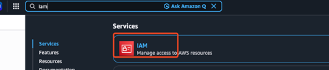

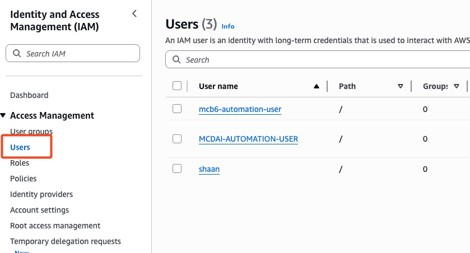

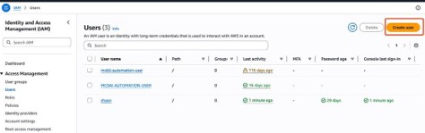

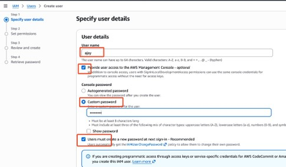

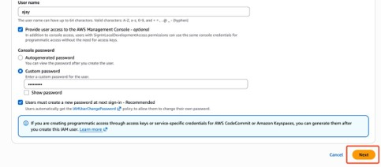

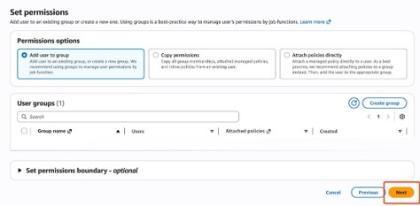

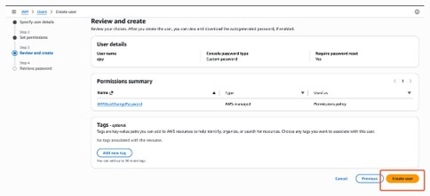

In a real-world organization, the DevOps or Cloud Platform team creates the IAM user account. Once the account is created, they share the username, temporary password, 12-digit AWS Account ID, and AWS sign-in URL with the user. The user (Ajay) can then log in to the AWS Management Console to verify the access assigned to the account.

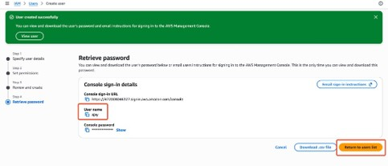

---

## Step 2

User will login to verify his access using below:

- Account ID
- Username
- Password

Note: Take private/incognito window or take a seperate browser. 
https://aws.amazon.com/

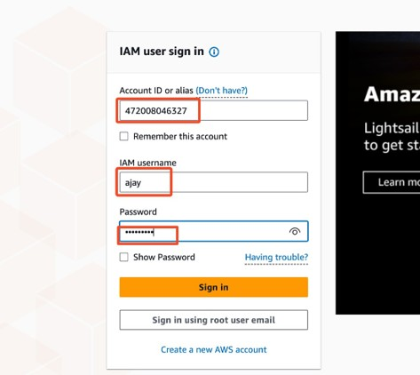

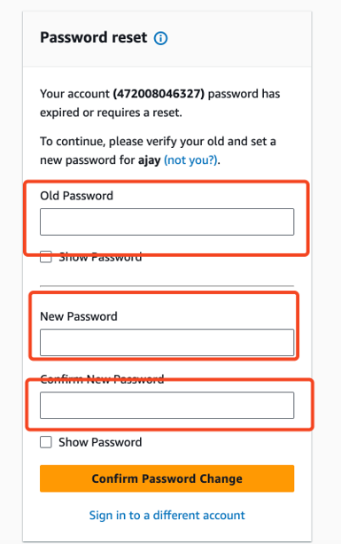

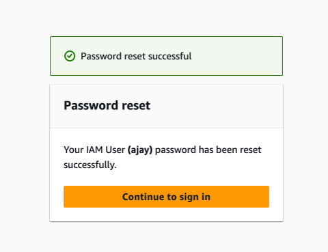

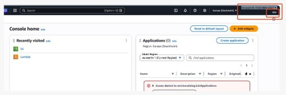

If you observe above, this user ajay is a dummy user. He don't have any access

---

## Step 3

Search Lambda.

Observe:

```
Access Denied
```
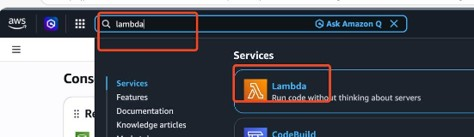

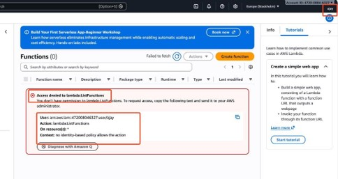
In simple, 'ajay' user is a dummy user where don't have any access 

---

## Step 4

Attach AWS Managed Policies:

- AWSLambdaFullAccess
- AmazonS3FullAccess

Assigning AWS Managed Policy: lambda, S3 full access policies to the user

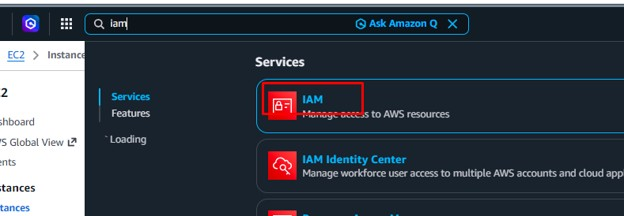

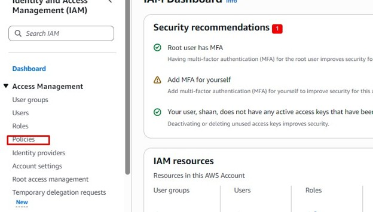

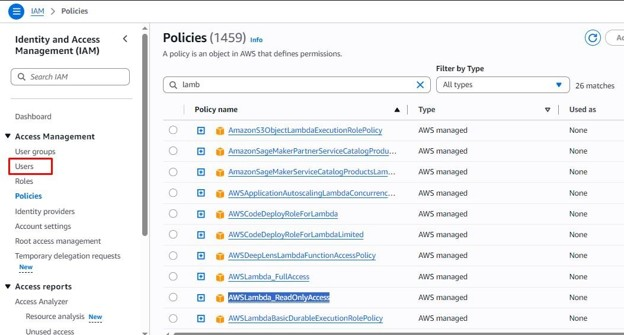

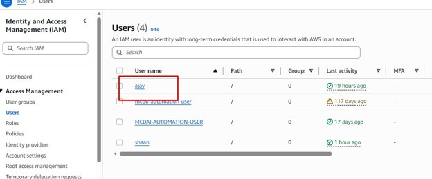

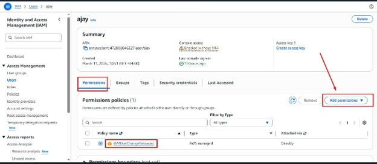

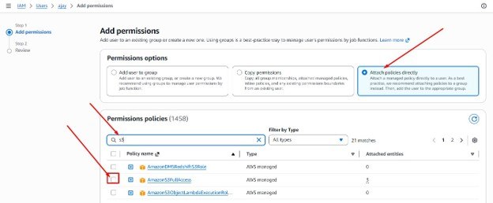

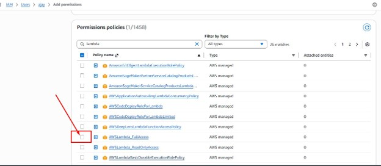

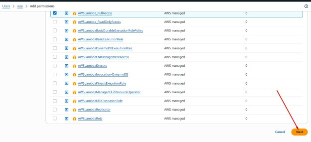


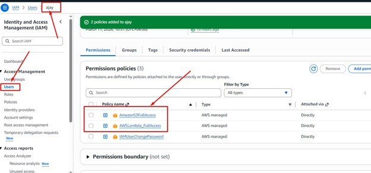

---

## Step 5

Login again.

Verify:

✅ Lambda Access

✅ S3 Access

Final Verification:

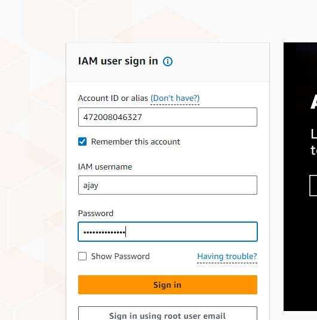

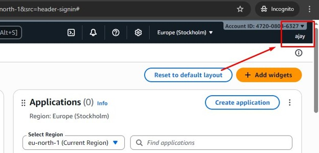

Note: If you have buckets then it will display otherwise it won’t throw any error message

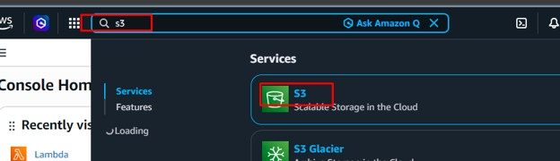

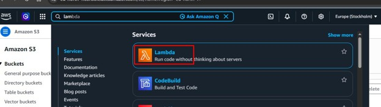


---

# 💼 Real Enterprise Scenario

Developer joins the company.

↓

Platform Team creates IAM User.

↓

Developer logs in.

↓

Developer cannot access Lambda.

↓

Developer raises a ticket.

↓

Platform Team attaches required Policy.

↓

Developer gains access.

This is how IAM works in real organizations.

---

# 🎯 Interview Questions

### 1. What is IAM?

### 2. Difference between Authentication and Authorization?

### 3. Why does an IAM User receive Access Denied?

### 4. Difference between Permission and Policy?

### 5. What is an AWS Managed Policy?

### 6. What is a Customer Managed Policy?

### 7. Difference between Root User and IAM User?

### 8. Can an IAM User access AWS services immediately after login?

### 9. Why should we avoid using Root User daily?

### 10. What is the Principle of Least Privilege?

---

# ❌ Common Mistakes

- Giving AdministratorAccess to every user.
- Using Root User for daily work.
- Confusing Authentication with Authorization.
- Assigning unnecessary permissions.
- Ignoring MFA.
- Not following the Principle of Least Privilege.

---

# 📝 Summary

✅ IAM controls who can access AWS resources.

✅ Authentication verifies identity.

✅ Authorization decides what actions are allowed.

✅ IAM Users receive **no permissions by default**.

✅ Permissions define individual actions.

✅ Policies are collections of permissions.

✅ AWS Managed Policies are maintained by AWS.

✅ Customer Managed Policies are maintained by organizations.

---

⭐ If this repository helped you understand AWS IAM, consider giving it a **Star**!
