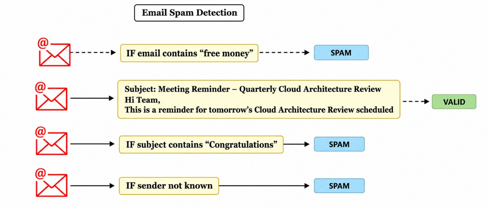
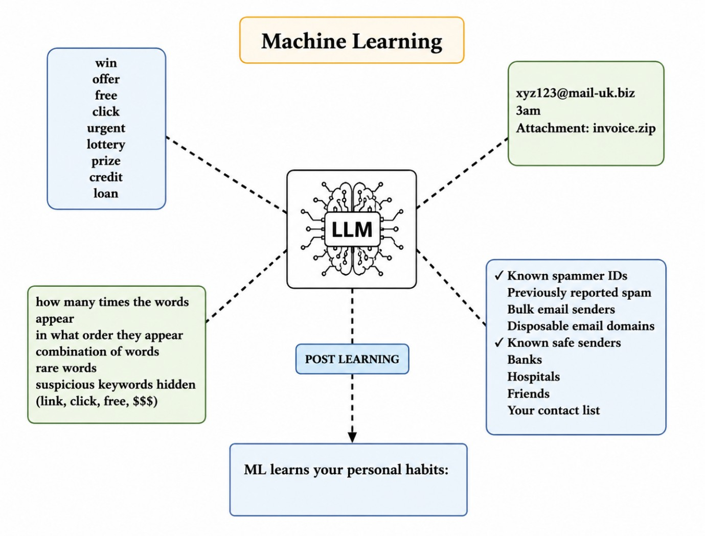
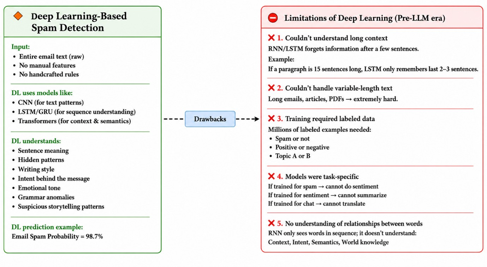
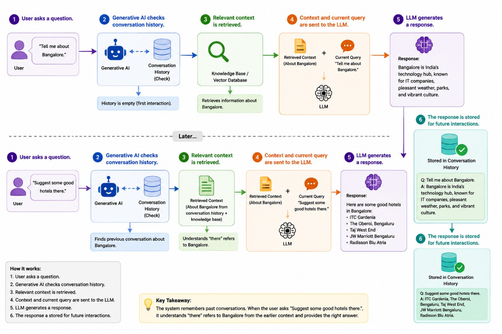

# AI Evolution: From Rules Engine to Generative AI

## 📖 Summary

This document explains the evolution of Artificial Intelligence from traditional rule-based systems to modern Generative AI. It highlights why each technology emerged, the limitations of previous approaches, and how Large Language Models (LLMs) and Generative AI are transforming enterprise applications.

## 🚀 Evolution of AI

```
Rules Engine
      ↓
Machine Learning
      ↓
Deep Learning
      ↓
Large Language Models (LLMs)
      ↓
Generative AI
```

Each stage was introduced to overcome the limitations of the previous one.


## 📌 Key Learnings

### Rules Engine
- Uses predefined IF–THEN rules.
- Easy to understand but difficult to maintain.
- Fails when new patterns appear.

**Example:**

IF email contains **"lottery"**
→ Mark as Spam

IF email contains **"free money"**
→ Mark as Spam

IF sender is unknown
→ Mark as Spam

**Problem**

A spammer can easily bypass these rules by changing the words.

Example:

- lottery → l0tt3ry
- money → m0ney

The rule no longer matches, so the spam email reaches the inbox.

**Limitation**
- Too many rules to maintain.
- New spam patterns require new rules.
- Easy to bypass.



---

### Machine Learning
- Learns patterns from training data instead of fixed rules.
- More accurate than rule-based systems.
- Requires retraining whenever new data or patterns emerge.

**Example:**
The model learns features like:

- free
- win
- offer
- prize
- lottery
- loan
- credit

Now the model predicts whether an email is spam based on learned patterns instead of exact words.

**Advantage**

It can detect many variations of spam without writing thousands of rules.

**Limitation**

Whenever new spam techniques appear:

1. Collect new data
2. Retrain the model
3. Deploy a new model

This takes time, engineers, infrastructure, and money.



---

### Deep Learning
- Uses Artificial Neural Networks inspired by the human brain.
- Learns complex patterns and language features like sentence structure, writing style, grammar, user intent, emotional tone.
- Better than traditional ML but lacks long-term memory and general-purpose intelligence.

**Example**

Subject:
> Congratulations! You've won an exclusive reward.

Even if the email doesn't contain the word "lottery", the model understands that the overall message looks like spam.

**Advantage**

Detects complex spam patterns much better than traditional Machine Learning.

**Limitation**

- Doesn't remember long conversations.
- Usually trained for one specific task.
- Cannot easily perform many different tasks using the same model.





---

### Large Language Models (LLMs)
- Trained on massive amounts of text.
- Can understand and generate human language.
- Stateless by nature—they do not remember previous conversations unless context is provided.

### Example

User asks:

> I am planning to visit Bangalore. Can you describe Bangalore in two lines?

LLM Response:

> Bangalore is the capital city of Karnataka and is known as India's Silicon Valley. It is famous for its pleasant weather and thriving IT industry.

The LLM answers because it has learned about Bangalore during training.

### Another Example

LLM can answer questions like:

- What is the capital of India?
- Who is the CEO of Infosys?
- Explain Machine Learning.

These are part of its trained knowledge.

### Limitation

LLMs are **stateless**.

Suppose the conversation is:

User:

> Tell me about Bangalore.

LLM:

> Bangalore is India's Silicon Valley...

Later the user asks:

> Suggest some good hotels there.

A pure LLM **does not know** that **"there" means Bangalore**, because it does not remember previous conversations unless the earlier context is sent again.

---

### Generative AI
- Combines LLM with: 
  - Memory
  - Conversation History
  - Context Management
  - Database
  - APIs
  - External Tools
- Provides contextual and conversational experiences.
- Makes applications like ChatGPT, Claude, Gemini, and Grok possible.

### Example

User:

> Tell me about Bangalore.

Generative AI stores both the question and the response.

Later the user asks:

> Suggest some good hotels there.

The Generative AI application:

1. Retrieves the previous conversation.
2. Understands that **"there" refers to Bangalore**.
3. Sends both the previous context and the new question to the LLM.
4. The LLM generates a context-aware response.

Response:

> Here are some popular hotels in Bangalore:
> - Taj West End
> - The Oberoi Bengaluru
> - ITC Gardenia
> - Radisson Blu
> - Holiday Inn

### Why it works

Unlike a standalone LLM, Generative AI **remembers previous conversations** by storing chat history in memory or a database.

This makes the interaction continuous and context-aware.




---

**Key Point**

- **LLM = Knows language but has no memory (Stateless).**
- **Generative AI = Uses LLM + Memory + Context + Databases + APIs to provide intelligent, context-aware conversations.**

---

## 🧠 LLM vs Generative AI

| LLM | Generative AI |
|------|---------------|
| Language model | Complete AI application |
| Stateless | Stateful |
| Uses only trained knowledge | Uses context, memory, tools, and enterprise data |
| No conversation memory | Maintains conversation history |

## 📝 Prompt Engineering

Prompt Engineering is the practice of designing effective prompts to guide AI models toward producing accurate, relevant, and well-structured responses.

Common techniques include:
- Zero-shot Prompting
- One-shot Prompting
- Few-shot Prompting
- Instruction Prompting
- Prompt Optimization

## 🏢 Enterprise AI

Public LLMs are trained on publicly available information.

Enterprise Generative AI extends LLMs by securely connecting them to:
- Internal databases
- Company documents
- APIs
- Business applications
- Private knowledge bases

This enables AI systems to answer organization-specific questions while protecting sensitive data.

## 🎯 Conclusion

The journey from Rules Engine to Generative AI demonstrates how AI has evolved to become more intelligent, adaptable, and context-aware. Modern enterprise AI applications combine the reasoning capabilities of LLMs with private organizational data, memory, and external tools, making Generative AI one of the most impactful technologies in today's software industry.
